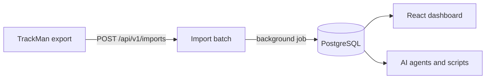

# Swing-Stack

[](https://github.com/chayuto/swing-stack/actions/workflows/ci.yml)

Store your golf launch monitor data. See it as charts. Query it from an API.

<picture>
  <source media="(prefers-color-scheme: dark)" srcset="docs/screenshots/dashboard-dark.png">
  
</picture>

*The dashboard follows your system theme. Light and dark are both first class.*

## What you get

- **Dispersion fan.** Top-down view of every shot from the tee, with a 1-sigma ellipse per club.
- **Ball flight.** Side view of every recorded trajectory. Hover to isolate a shot.
- **Gapping.** Carry per club: every shot, the mean, and the spread.
- **Shot shape.** Face angle against club path, so you can see a hook or slice
  pattern building. Click a dot to exclude a mishit from every stat.
- **Progress over time.** Every shot in order across sessions, with a rolling
  average per club and a latest-vs-earlier readout. Face angle by default,
  or any of eleven metrics.
- **Club averages.** Speed, smash, spin, apex, and dispersion, computed in the database.
- **3D shot view.** The current filter selection in an interactive 3D scene:
  orbit camera, hover metadata, and replay where every ball launches at once
  with its real reconstructed timing. Powered by
  [golf-shot-viz](https://github.com/chayuto/golf-shot-viz), a standalone
  library extracted from this project
  ([npm](https://www.npmjs.com/package/golf-shot-viz),
  [live demo](https://chayuto.github.io/golf-shot-viz)) and consumed from
  the registry like any other dependency. This repo is its reference
  consumer.
- **An API for everything.** The dashboard is just a client. Scripts and AI agents get their own scoped keys.

## Run it

```sh
# API (Rails 8.1 + PostgreSQL)
bundle install
bin/rails db:prepare db:seed
bin/rails server

# Dashboard (React + Vite)
cd web
npm install
npm run dev        # http://localhost:5173
```

Drop your TrackMan report exports into `data/` and run
`bin/rails trackman:ingest`. Files are tracked by checksum in
`import_batches`, so only new exports are parsed. Ingesting never
duplicates shots, and the task flags any club config it has not seen
before. Claim new configs in the bag definition in `db/seeds.rb` and
re-run `bin/rails db:seed`; `bin/rails trackman:reclassify` re-resolves
existing shots from their stored payloads after the map changes.
`db:seed` bootstraps a fresh database the same way.

Every edit to telemetry is audited (paper_trail): before/after diffs
plus the actor. Re-imports attribute to their import batch, dashboard
and API edits to the user or agent token, seed fixes to `seeds`.
`bin/rails trackman:audit` prints recent changes.

`docker compose up --build` starts the API and PostgreSQL in one command.

## Back up and restore

There is no hosted deployment. The database on your machine is the only
copy, so snapshots are the safety net.

```sh
bin/rails snapshot:create                 # data/snapshots/20260719_213045_swing_stack_development.dump
bin/rails "snapshot:create[pre_import]"   # optional label
bin/rails snapshot:list
CONFIRM=1 bin/rails snapshot:restore      # newest snapshot, wipes the database first
bin/rails "snapshot:prune[10]"            # keep the newest 10
```

Snapshots are compressed pg_dump archives, so they restore on any machine
with the same or newer PostgreSQL. They carry the same personal data as the
raw exports, which is why they live in the gitignored `data/` directory.

## How it works



Imports return `202 Accepted` right away. A background job parses the export
and upserts sessions and shots using TrackMan's own UUIDs, so importing the
same file twice changes nothing.

## Design notes

- **Two auth lanes.** People sign in with short-lived JWTs and rotating refresh
  tokens. Machines get scoped API keys (`telemetry:read`, `telemetry:write`)
  that can never mint new credentials. Different clients fail differently, so
  they authenticate differently.
- **Factual imports, interpreted clubs.** Every shot stores the club facts
  its export carried, verbatim: the club name (`bay_club`, the field
  TrackMan's own UI groups by) and the bay's loft config (`bay_loft_deg`).
  The name decides the club where present. Some exports omit it, and the
  loft config alone is unreliable (the bay attaches whatever it has
  selected; a 7 iron has arrived as 27.0, 35.5, 39.0 and 54.0 degrees), so
  nameless strokes resolve through a bag map (`db/seeds.rb`) from observed
  configs to real clubs. Unknown configs get a placeholder club until
  claimed. Club assignment is an interpretation you can always redo from
  the stored facts, never a destructive edit.
- **Analytics in the database.** Per-club averages and dispersion come from one
  grouped SQL query, not application code.
- **UUID keys and rate limits.** No guessable IDs, and Rack::Attack throttles
  every lane, including login attempts.

## API

| Endpoint | Purpose | Useful params |
|---|---|---|
| `POST /api/v1/auth/login` | Sign in, get tokens | |
| `POST /api/v1/api_tokens` | Create a scoped agent key | `name`, `scopes`, `ttl_seconds` |
| `POST /api/v1/imports` | Upload an export (async) | raw TrackMan JSON body |
| `GET /api/v1/shots` | Shot telemetry, 30+ metrics each | `session_id`, `club_id`, `min_carry`, `excluded`, `include=trajectory`, `page`, `per_page` |
| `PATCH /api/v1/shots/:id` | Flag a shot out of analysis | `excluded` |
| `GET /api/v1/sessions` | Practice sessions | |
| `GET /api/v1/clubs` | Clubs and labels | |
| `GET /api/v1/stats/clubs` | Per-club averages and dispersion | `session_id`, `min_carry` |

Humans send `Authorization: Bearer <jwt>`. Agents send `X-Api-Key`.
The full machine-readable description lives at `GET /api/v1/openapi.json`,
so an agent can discover the surface without reading the source.

## Tests

```sh
bundle exec rspec          # API specs against a real 52-shot export fixture
cd web && npx playwright test   # boots the full stack, tests the UI end to end
```

Playwright agent definitions (planner, generator, healer) for Claude Code live
in `.claude/agents/`. Chart marks carry `data-testid` attributes so agents and
tests can find them.

## Privacy

`data/` is gitignored. Launch monitor exports contain player names and emails,
so they never leave your machine. The test fixture is sanitized.

## Scope

Personal project and portfolio piece. I use it for my own range sessions.
Bug reports are welcome. Feature requests may not be implemented.
