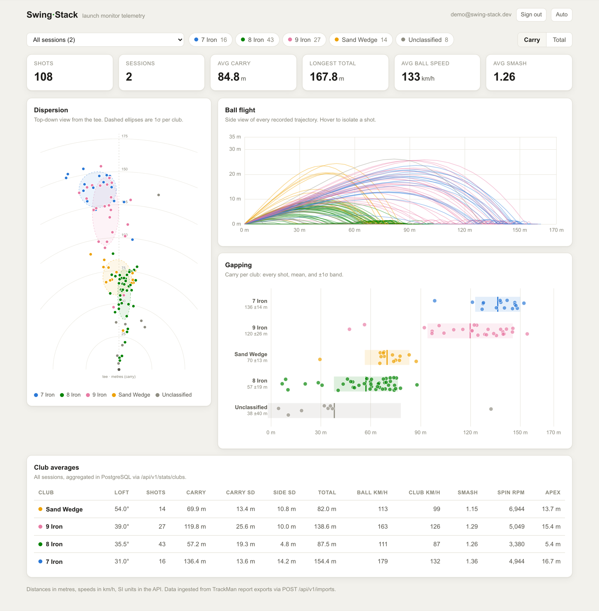
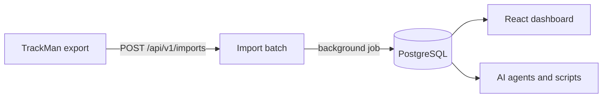

# Swing-Stack

[](https://github.com/chayuto/swing-stack/actions/workflows/ci.yml)

Store your golf launch monitor data. See it as charts. Query it from an API.

<picture>
  <source media="(prefers-color-scheme: dark)" srcset="docs/screenshots/dashboard-dark.png">
  
</picture>

*The dashboard follows your system theme. Light and dark are both first class.*

## What you get

- **Dispersion fan.** Top-down view of every shot from the tee, with a 1-sigma ellipse per club.
- **Ball flight.** Side view of every recorded trajectory. Hover to isolate a shot.
- **Gapping.** Carry per club: every shot, the mean, and the spread.
- **Shot shape.** Face angle against club path, so you can see a hook or slice
  pattern building. Click a dot to exclude a mishit from every stat.
- **Progress over time.** Every shot in order across sessions, with a rolling
  average per club and a latest-vs-earlier readout. Face angle by default,
  or any of eleven metrics.
- **Club averages.** Speed, smash, spin, apex, and dispersion, computed in the database.
- **An API for everything.** The dashboard is just a client. Scripts and AI agents get their own scoped keys.

## Run it

```sh
# API (Rails 8.1 + PostgreSQL)
bundle install
bin/rails db:prepare db:seed
bin/rails server

# Dashboard (React + Vite)
cd web
npm install
npm run dev        # http://localhost:5173
```

Drop your TrackMan report exports into `data/` and re-run `bin/rails db:seed`.
Re-seeding never duplicates shots.

`docker compose up --build` starts the API and PostgreSQL in one command.

## How it works



Imports return `202 Accepted` right away. A background job parses the export
and upserts sessions and shots using TrackMan's own UUIDs, so importing the
same file twice changes nothing.

## Design notes

- **Two auth lanes.** People sign in with short-lived JWTs and rotating refresh
  tokens. Machines get scoped API keys (`telemetry:read`, `telemetry:write`)
  that can never mint new credentials. Different clients fail differently, so
  they authenticate differently.
- **Clubs from loft.** Exports do not name the club. The club head's static
  loft is a stable fingerprint, so shots group themselves and you attach labels
  like "7 Iron" once.
- **Analytics in the database.** Per-club averages and dispersion come from one
  grouped SQL query, not application code.
- **UUID keys and rate limits.** No guessable IDs, and Rack::Attack throttles
  every lane, including login attempts.

## API

| Endpoint | Purpose | Useful params |
|---|---|---|
| `POST /api/v1/auth/login` | Sign in, get tokens | |
| `POST /api/v1/api_tokens` | Create a scoped agent key | `name`, `scopes`, `ttl_seconds` |
| `POST /api/v1/imports` | Upload an export (async) | raw TrackMan JSON body |
| `GET /api/v1/shots` | Shot telemetry, 30+ metrics each | `session_id`, `club_id`, `min_carry`, `excluded`, `include=trajectory`, `page`, `per_page` |
| `PATCH /api/v1/shots/:id` | Flag a shot out of analysis | `excluded` |
| `GET /api/v1/sessions` | Practice sessions | |
| `GET /api/v1/clubs` | Clubs and labels | |
| `GET /api/v1/stats/clubs` | Per-club averages and dispersion | `session_id`, `min_carry` |

Humans send `Authorization: Bearer <jwt>`. Agents send `X-Api-Key`.
The full machine-readable description lives at `GET /api/v1/openapi.json`,
so an agent can discover the surface without reading the source.

## Tests

```sh
bundle exec rspec          # API specs against a real 52-shot export fixture
cd web && npx playwright test   # boots the full stack, tests the UI end to end
```

Playwright agent definitions (planner, generator, healer) for Claude Code live
in `.claude/agents/`. Chart marks carry `data-testid` attributes so agents and
tests can find them.

## Privacy

`data/` is gitignored. Launch monitor exports contain player names and emails,
so they never leave your machine. The test fixture is sanitized.

## Scope

Personal project and portfolio piece. I use it for my own range sessions.
Bug reports are welcome. Feature requests may not be implemented.
